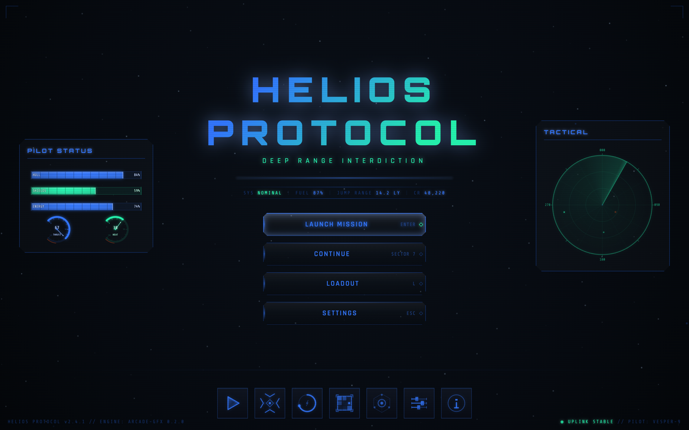
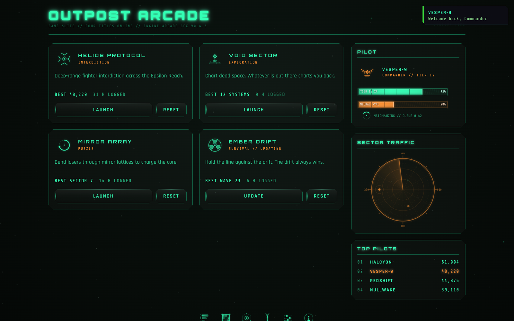
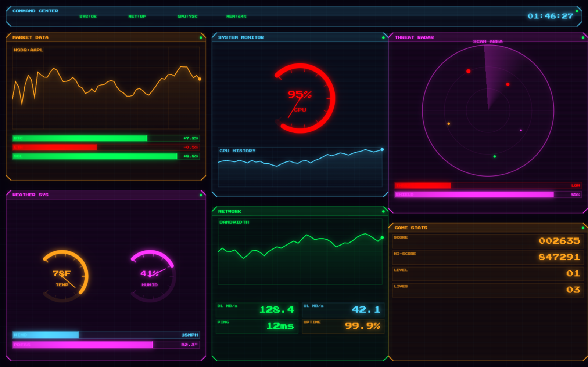
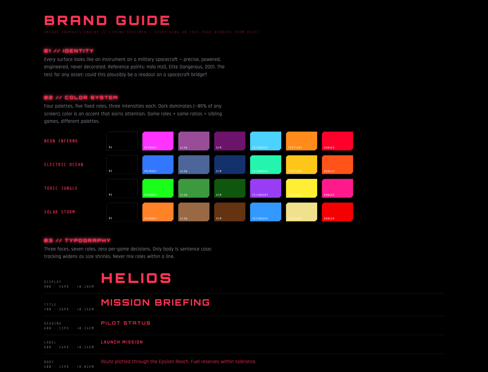

# Arcade Graphics Engine

A sleek, futuristic graphics engine and UI style library for browser-based
arcade games. Install it into any game repo and the game gets the house
visual identity — icons, HUD instruments, menus, typography, and theming —
so every game built on it looks like it belongs in the same universe.

**Style**: Halo HUD · Elite Dangerous cockpit · *2001* instrument panels.
Dark fields, thin glowing lines, gradient fills, clipped corners.
Not pixel art, not retro, not cute.

> **Scope**: this is the house style engine behind my own arcade games, published
> so the work is readable and so my games can install it by tag. It's not a
> supported package — there's no roadmap, no issue triage, and the API changes
> when my games need it to. Fork it freely; just don't depend on it staying put.



*`tests/fake-game-home` — title, menu, pilot-status panel, gauges, radar and icon
rail, all drawn by the engine from a single palette pick.*

## In production

| Where | What the engine does |
|---|---|
| **[wesleyarcade.com](https://wesleyarcade.com/)** | The arcade hub — landing page and shell, on a vendored engine build |
| **[wesleyarcade.com/reflections](https://wesleyarcade.com/reflections/)** | *Reflections*, a laser-defense puzzle game — HUD, icons, and theme ([source](https://github.com/TomWesley/ReflectionsPhaser)) |

Both vendor a built copy of `dist/` rather than installing from git, so a site
deploy never depends on this repo being reachable.

## Install

Pin to a release tag — installs are then reproducible and upgrades are
deliberate:

```bash
npm install github:TomWesley/ArcadeGraphicsEngineAndLibrary#v0.5.0
```

The package builds itself on install (`prepare` script). ESM and CJS both
supported, TypeScript types included.

## Browser support

| Browser | Minimum | Notes |
|---|---|---|
| Chrome / Edge | 99+ | Full support |
| Firefox | 110+ | Full support |
| Safari | 16.4+ | Full support |
| Safari | 15.x–16.3 | Supported — radar sweep uses a stepped-wedge fallback instead of a conic gradient |

No polyfills required. Server-side rendering is safe: CSS/font injection and
overlays (dialogs, toasts, loading) no-op or reject cleanly when `document`
is undefined, so importing the engine in Node/SSR never throws at module load.
Gauge inputs are sanitized — a `NaN` or `Infinity` value renders as empty,
not garbage.

## Quickstart

```javascript
import {
  ThemeProvider,
  drawIcon, drawPanel, drawBarGauge, drawRadialGauge, drawRadarDisplay,
  setupHiDPICanvas, applyType,
} from '@tomwesley/arcade-graphics-engine';

// 1. One palette pick reskins everything (or .custom(...) for your own hues)
const provider = ThemeProvider.create('ELECTRIC_OCEAN');
provider.injectCSS();                          // CSS vars + classes + fonts
document.body.classList.add('arcade-theme');

// 2. Crisp canvas on any display
const { ctx, width, height } = setupHiDPICanvas(myCanvas);

// 3. Draw with the theme
const theme = provider.theme;
drawIcon(ctx, 'target', 40, 40, 48, provider.palette.primary.core);
drawBarGauge(ctx, theme, { x: 10, y: 80, width: 220, height: 22, value: 0.7, label: 'HULL', showValue: true });
drawRadarDisplay(ctx, theme, { x: 250, y: 20, size: 160, sweepAngle: t, blips });
```

Weak hardware? `ThemeProvider.create('ELECTRIC_OCEAN', { lowPower: true })`
collapses the glow system to a single cheap pass.

## What's inside

| Area | Highlights |
|---|---|
| **Theming** | 4 built-in palettes + custom hues; CSS variable injection; `.arcade-btn/panel/input/...` classes; SSR-safe |
| **Typography** | 7 fixed type roles (Orbitron/Rajdhani/Share Tech Mono), CSS classes + canvas helpers |
| **Icons** | 40 hand-built HUD icons + aliases, palette-tinted, `drawIcon`/`drawFramedIcon` |
| **Instruments** | Panels, segmented bar gauges, radial gauges, radar with phosphor sweep, charts |
| **Overlays** | Modal dialogs/confirms, toasts, loading screens — themed, a11y-aware, SSR-safe |
| **Controls** | Canvas-drawn buttons with states + hit testing (for pure-canvas UIs) |
| **Motion** | Approved easing curves (no bounce), animate/approach helpers, shared durations |
| **Effects** | Ambient particles, scan lines, corner flourishes, canvas bloom |
| **Engine** | PixelBuffer ops, Gaussian blur, Sobel edges, bloom, particles, sprite pipeline |
| **A11y/perf** | `prefers-reduced-motion` respected, keyboard focus states, low-power glow mode, HiDPI helper |

## Screens

Same components, different palettes — the whole point of the library.



*A four-title game suite: cards, XP meters, sector radar, leaderboard. One
custom palette, no per-screen color decisions.*



*The instrument set pushed hard — line charts, segmented bars, radial gauges
with danger arcs, and a radar whose sweep reveals contacts with phosphor decay.*



*`npm run test:brand` renders the brand guide from `dist/` — the palettes and
type scale are a living specimen, not a static document.*

## Documentation

- **[BRANDING.md](BRANDING.md)** — the definitive brand guide: identity,
  color roles, type system, shape language, glow rules, motion, voice.
- **[CLAUDE.md](CLAUDE.md)** — the integration manual (also read by AI
  assistants working in consuming game repos): quickstart, icon authoring
  recipes, component APIs.
- **[CHANGELOG.md](CHANGELOG.md)** — release history.

## Live reference pages

```bash
npm run test:brand      # living brand guide — palettes, type, icons, components
npm run test:components # interactive lab — dialogs, toasts, loading, canvas buttons
npm run test:homepage   # complete fake game home page built from the engine
npm run test:iconreview # icon library review board
npm run test:hud        # animated command-center dashboard
```

## Development

```bash
npm install
npm run typecheck
npm test                 # 198 unit tests
npm run test:integration # consumer-surface integration tests
npm run build
```

CI runs typecheck, build, and both test suites on every push.

## License

[MIT](LICENSE) — covers the code. The sample renders in `tests/convert` are
generic 3D assets with no third-party IP.
